# ISDN_5240 cuRobo配置教程
此教程主要实现了在云端服务器中配置 cuRobo

本次安装教程参考Nvidia的官方教程，链接如下
```
https://nvlabs.github.io/curobo/latest/getting-started/installation.html
```
## 基础环境：
xxx


## 配置流程
### 步骤一： 创建云端服务器
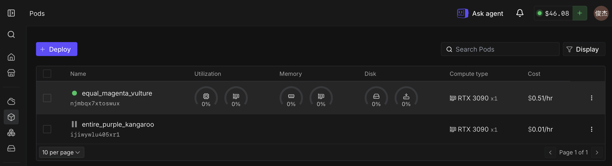
### 步骤二：完成ssh连接
成功完成连接后，会出现runpod字样
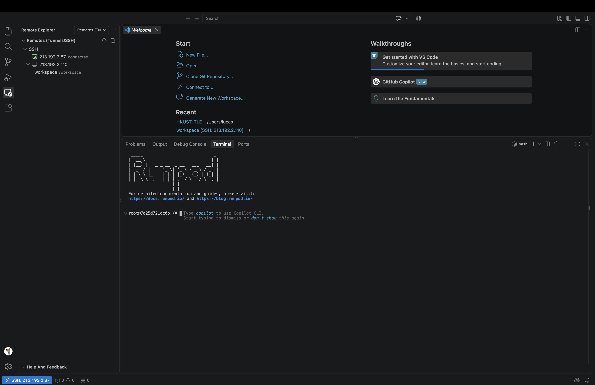
### 步骤三：检查服务器中的uv是否安装成功
使用如下命令查看uv的版本
```
uv -V
```
如果已经安装，会出现如下结果（后面的版本号可能不一样）
```
uv 0.9.0
```
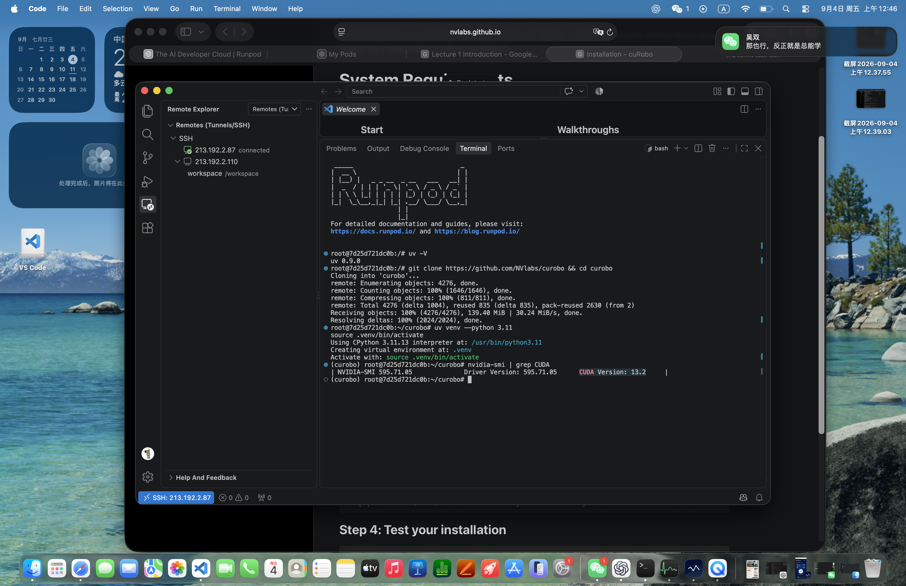
如果无法显示版本号，则需先安装uv，详细的安装教程可以参考
```
https://docs.astral.sh/uv/getting-started/installation/
```
或尝试如下命令进行安装
```
curl -LsSf https://astral.sh/uv/install.sh | sh
```
安装成功后再用```uv -V```检查是否成功

### 步骤四：拉取cuRobo
将cuRobo文件从github项目源拉取到服务器本地，并进入到curobo目录中
```
git clone https://github.com/NVlabs/curobo && cd curobo
```
输入后，会出现一段拉取进度条，等待完成后，检查是否已经进入到了curobo目录中，会有类似如下字段

root@7d25d721dc0b:~/curobo#


### 步骤五：创建虚拟环境
创建虚拟环境，为后续依赖的配置做准备
```
uv venv --python 3.11
source .venv/bin/activate
```
创建完成后可以看到类似于如下的字段，最前面的(curobo)意味着已经进入到这个虚拟环境中了

(curobo) root@7d25d721dc0b:~/curobo#


### 步骤六：检查cuda版本
使用如下命令检查服务器中安装的cuda版本
```
nvidia-smi | grep CUDA
```
结果类似于下方字段
```
(curobo)
root@7d25d721dc0b:~/curobo# nvidia-smi | grep CUDA
NVIDIA-SMI 595.71.05  Driver Version: 595.71.05  CUDA Version: 13.2
```
确定服务器的CUDA Version是 12.x 还是13.x，我这里的版本是13.x

### 步骤七：安装cuRobo依赖
根据自己的服务器CUDA版本，安装对应的依赖

CUDA 13.x:
```
uv pip install .[cu13-torch]       # fresh install (includes PyTorch)
```
CUDA 12.x:
```
uv pip install .[cu12-torch]       # fresh install (includes PyTorch)
```
安装成功后的界面如图所示
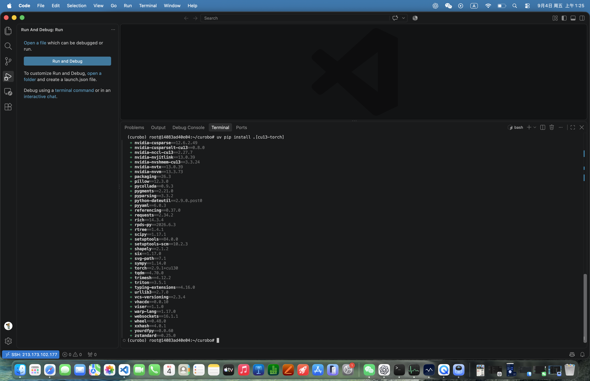
### 步骤八：测试cuRobo的安装
运行这两条命令
```
python -c "import curobo; print(curobo.__version__)"
```
```
pytest --pyargs curobo.tests
```
大概率运行结果如下，第一条成功，第二条报错
导致这个问题的原因是pytest未安装
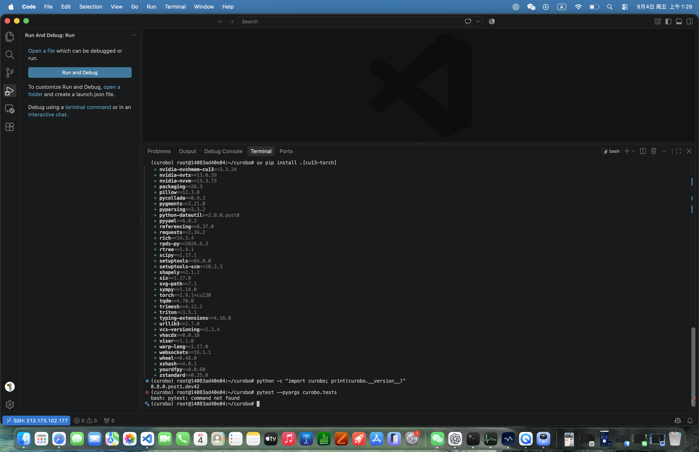
### 步骤九：安装pytest
运行下面这两条命令
先恢复 pip
```
python -m ensurepip --upgrade
python -m pip install --upgrade pip setuptools wheel
```
然后安装 pytest 及其并行插件
```
python -m pip install pytest pytest-xdist
```
安装成功后如图所示

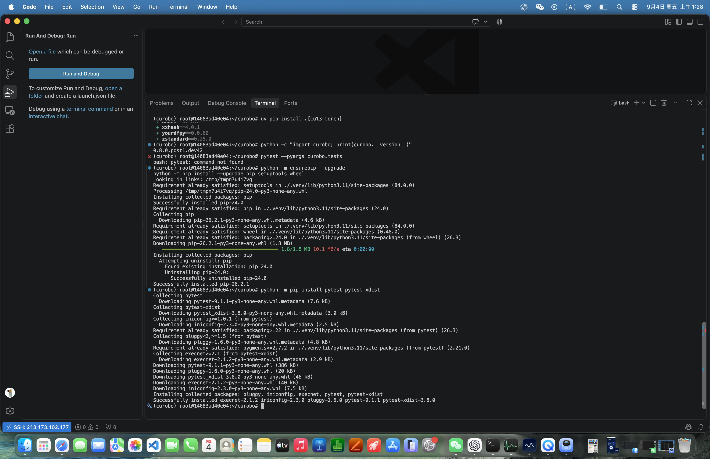

### 步骤十：创建运行文件
按照如图所示三步打开服务器中的文件夹

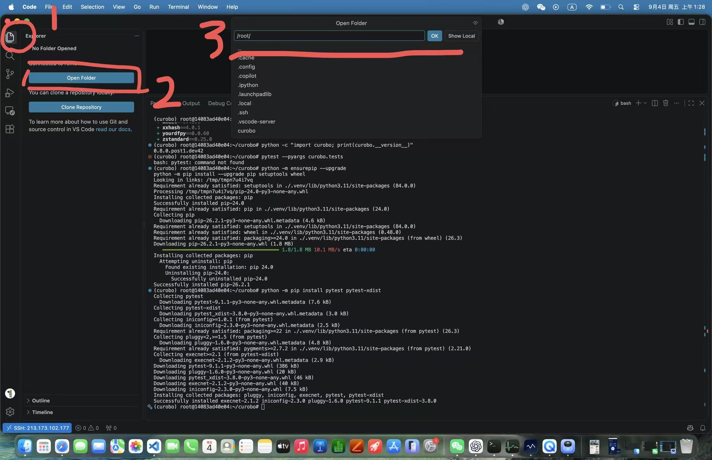

信任文件夹并继续

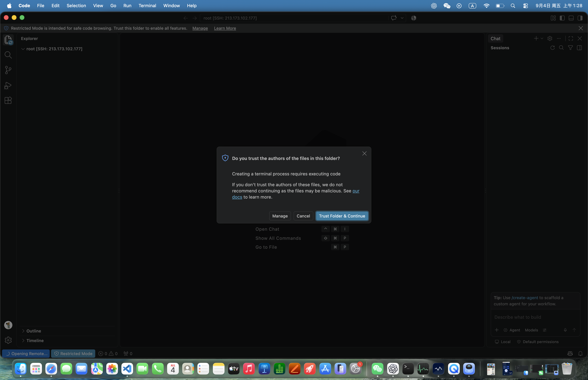

打开成功后可以看到左侧的目录

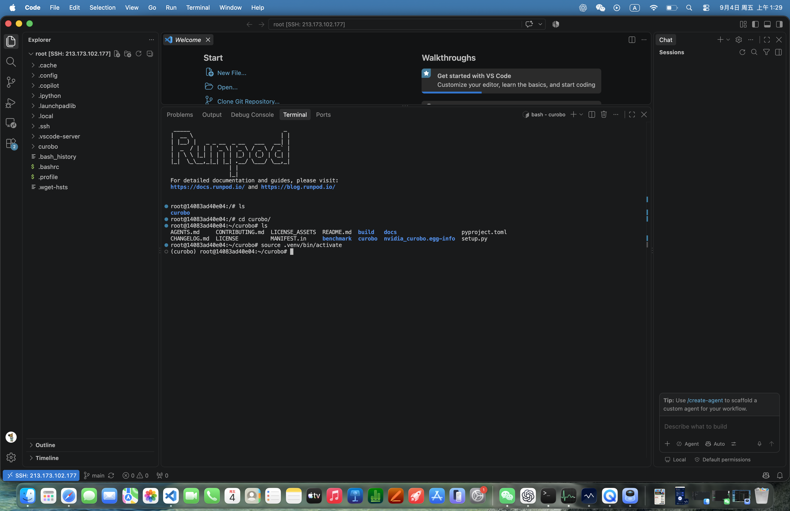

在空白处右键，选择new file新建一个文件，并取名hello_world.py

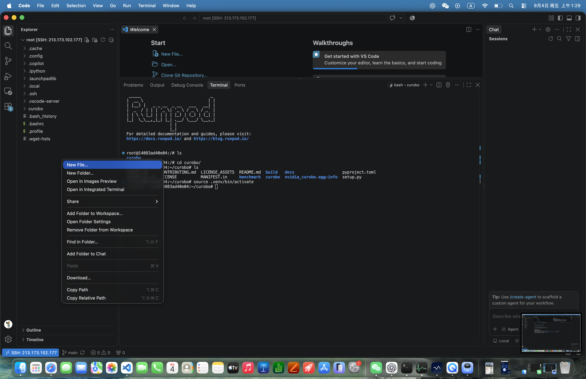

将如下内容粘贴至 hello_world.py 文件中，并保存
```
import time
from curobo.types import ContentPath
from curobo.viewer import ViserVisualizer

viz = ViserVisualizer(
   content_path=ContentPath(robot_config_file="franka.yml"),
   connect_ip="0.0.0.0",
   connect_port=8080,
   add_robot_to_scene=True,
   add_control_frames=False,
   visualize_robot_spheres=False,
)

while True:
   time.sleep(1)

```
### 步骤十一：运行启动文件
在终端中运行刚刚创建的python文件，出现如下效果，说明安装成功
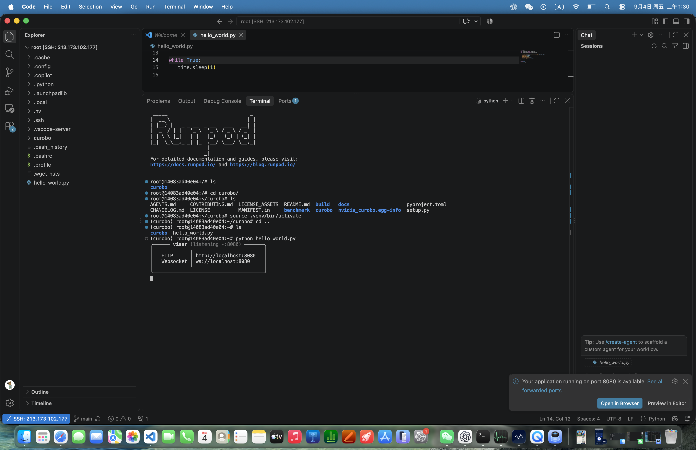
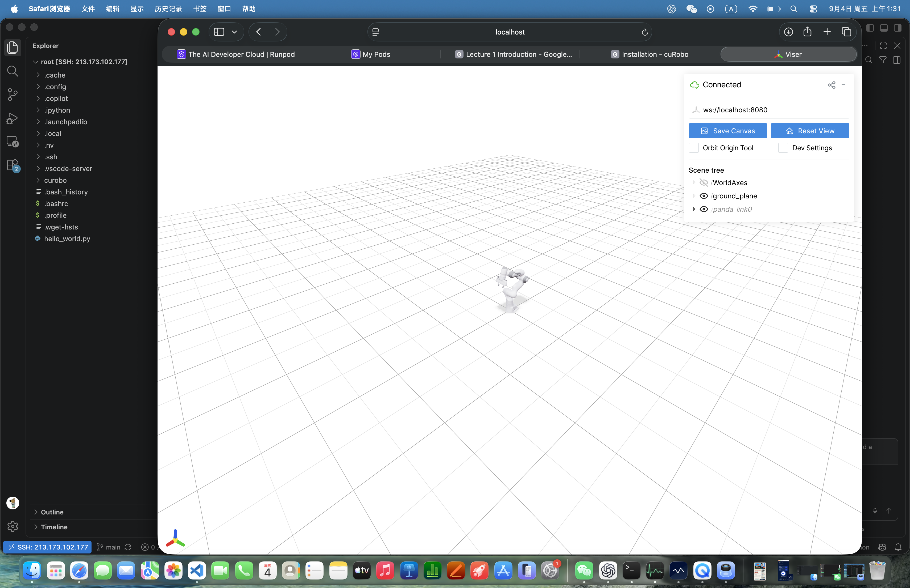